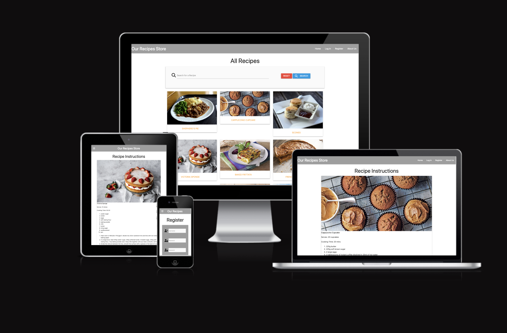

# Our Recipes Store

Our Recipes Store is an online resource to give anyone with an interest in cooking the opportunity to find recipes that they know are tried and true. They are able to search the site through the search engine option and click through to the detailed ingredients and steps to create their own version. By registering, users can share their recipes, by uploading, editing and can also delete their recipes should they wish to do so. 

## Table of Contents

[UX](#ux)

- [Goals](#goals)
    - Project Goals
    - Visitor Goals
- [User Stories](#user-stories)
- [Design Choices](#design-choices)
- [Wireframes](#wireframes)
- [Features](#features)

[Future Goals](#future-goals)

[Technology Used](#technology-used)

[Testing](#testing)

[UI](#ui)

[Navigation](#navigation)

 - [Add a Recipe](#add-a-recipe)
 - [Edit a Recipe](#edit-a-recipe)
 - [Delete a Recipe](#delete-a-recipe)
 - [Recipe Instructions](#recipe-instructions)

[Deployment](#deployment)

[Credits](#credits)

## UX

### Goals

**Project Goals: the main target audience for this project is as follows:**

- Registered users who want to share their own favourite recipes that work well for them
- Registered users who want to try other registered users' recipes
- Casual users who are looking for recipes without registering
- Casual users looking for new recipes to try

**User Goals: the main user goals are:**

- Provide a space to upload a favourite recipe
- Ensure the user's recipes are displayed on their profile page
- Ensure all recipes are displayed on the home page
- Create a search function that allows all recipes to be searched by name
- Ensure each recipe has it's own page with instructions to follow

## User Stories

- As a vistor to the site I would like to be able to share my favourite recipes
- As a vistor to the site I want to be able to view all my recipes in one place
- As a visitor to the site I want to be able to create, edit and delete my recipes
- As a visitor to the site I want to be able to see all the recipes available at a glance
- As a vistor to the site I want to be able to click on individual recipes without needing to log in
- As a visitor to the site I want to be able to see the recipes on my mobile phone

---

## Design Choices

**Fonts, Colours and Styling**

The overall focus of the site is the recipes, and therefore styling choices were kept minimal so as not to detract from what the user is wanting to use the site for. After some experimentation with bright colours early on in the process, it was felt that keeping the background to a basic white ensured that the images of the recipes were the main attraction, and kept the uploaded recipes looking appealing to the user.

The navigation elements and basic styling are based on Materialize template cards, navbar and footer elements.

When viewed on mobile the site uses the Hamburger icon collapsible menu to allow for the navbar content to be displayed appropriately for the screen size.

## Wireframes

- Our Recipes Store Desktop Homepage
- Mobile Site
- User Profile Page
- Full Recipe Page

---
## Future Goals

- Increase site usage to enable the following:
    - Consider monetizing options including range of cookware and or other cookery aids
    - Create an option to download/send all ingredients to a shopping list via a preferred vendor
    - Advertising on site for suitable advertisers linked to cookery 

- Site Functionality
    - Increase the search options to allow for searching on ingredients and cooking times
    - Create a filtered search for vegan/vegetarian/main meal/dessert/short cooking times
    - Add more images for recipes during the cooking process
    - Enable users to upload own images or current url option
    - Create a wildcard 'Inspire Me!' recipe option

---
## Technology Used

### Languages
- HTML
- CSS
- Javascript
- Python

### Tools
- MongoDB (https://www.mongodb.com/)
- Materialize (https://materializecss.com/)
- Flask (https://flask.palletsprojects.com/en/2.2.x/) 
- PIP (https://pypi.org/project/pip/)
- jQuery (https://jquery.com/)
- fontawesome (https://fontawesome.com/icons)

### Testing

**Validators**

- All pages passed HTML Verification with [W3Validator](validator.w3.org)
- All pages passed CSS Verification with [W3Validator](jigswa.w3.org)

## UI

### Navigation

- Nav bar displays correctly on all pages
- Clicking each link on the navbar has the expected response
- Registering creates a user id
- Password must match to create user id
- Logging in requires correct username and password
- User's profile screen displays only their uploaded recipes
- User is able to upload, edit and delete recipes on the respective page
- User is able to view recipe instructions 
- User is not able to edit or delete another user's recipes
- User is able to log out
- Admin is able to edit and delete recipes when logged in as admin account
- Casual user is able to view all recipes without creating log in
- Casual user is able to view recipe instructions without registering/logging in
- Casual user is not able to add, edit or delete recipes
- Custom pages 500 error and 404 error work as and when required
- Footer displays on each page

### Footer

- Footer links displayed for Facebook and Instagram. Both links navigate to sites. Additional code required to ensure they open in new web pages
- Copyright is not a link and is not set to be one

### Add a Recipe

- Link from navbar correctly directs logged in user to create a recipe
- Info required for uploading recipe info displays as required
- Info is sent to database on MongoDB

### Edit a Recipe

- Logged in user is able to see their recipes on profile and on main recipes page and can click through to edit page
- Current info held about recipe is retrieved from MongoDB
- User is able to amend recipe and submit corrections to MongoDB

### Delete a Recipe

- Logged in user is able to see their recipes on profile and on main recipes page and can click through to edit page
- User is able to delete recipe 
- Confirmation is required to delete
- Recipe is deleted from MongoDB and user's profile

### Recipe Instructions

- All users are able to click link from main page to view recipe instructions
- Large image is correctly displayed to users on navigating to page
- Info is correctly displayed for all stages of recipe
- Info about who uploaded the recipe is correctly displayed
- User cannot amend the recipe from this page even if logged in

## Responsive Design

### Mobile, Tablet and Desktop

All aspects working correctly across all sized screens. Tested on Chrome and Safari.

---
## Issues and resolutions

---
* Problem: Error when reading css file
* Cause: Not linking correctly to file
* Resolution: Amend linking and use test colour background to confirm file link is working properly
---
* Problem: Navbar not linking to all pages on mobile site
* Cause: Links not updated at the same time as desktop links
* Resolution: All links updated and tested
---
* Problem: Register functionality is failing
* Cause: Spelling causing failure
* Resolution: Edit spelling
---
* Problem: Recipe ingredients and method are badly displayed on input page
* Cause: Limited by number of characters 
* Resolution: Amended to textarea, with consideration that this will be amended again in the future
---
* Problem: Recipe ingredients and method do not show as list with user input
* Cause: Amendment to textarea input from above problem
* Resolution: Textarea is stop-gap method, long term aim is to change format of card input to improve, issue to remain in short term as site does function
---
* Problem: User Profile not showing recipes
* Cause: Code incorrectly written to generate info
* Resolution: Amendment to code
---
* Problem: Recipe image not displaying despite link in MongoDB
* Cause: image link not correctly written
* Resolution: Minor amendments to MongoDB and image link to ensure all is matching correctly
---
* Problem: Url Link not retrieving properly when entered via add recipe page
* Cause: link is Null in MongoDB
* Resolution: Amend input type to text with consideration that images maye be hosted elsewhere in future
---

## Deployment

This was developed using a [GitPod](https://gitpod.io/ "Link to GitPod") workspace. The code was commited to [Git](https://git-scm.com/ "Link to Git") and pushed to [GitHub](https://github.com/ "Link to GitHub") using the terminal.

To deploy this page to Heroku from its GitHub repository, the following steps were taken:

1. Create a new app on the [Heroku website](https://dashboard.heroku.com/apps) by clicking the "New" button in your dashboard. Give it a name and set the region to Europe.

2. From the heroku dashboard of your newly created application, click on "Deploy" > "Deployment method" and select GitHub.

3. Confirm the linking of the heroku app to the correct GitHub repository.

4. In the heroku dashboard for the application, click on "Settings" > "Reveal Config Vars".

5. Set the following config vars:

- IP: 0.0.0.0
- PORT: 5000
- MONGO_URI: Your MONGO URI
- SECRET_KEY: Your SECRET_KEY

- To get your MONGO_URI read the MongoDB Atlas documentation [here](https://docs.atlas.mongodb.com/)

6. In the heroku dashboard, click "Deploy".

7. In the "Manual Deployment" section of this page, made sure the master branch is selected and then click "Deploy Branch".

8. The site is now successfully deployed.

## Credits

This project is indebted to the Code Institute's Mini Project on Non-Relational Database Management Systems and the Introduction to Flask: The Flask Framework walkthrough.

Images were sourced through Google Image search. All credits for these remain with the original photographers.

I couldn't have managed to get this far without the endless encourangement and assistance of my amazing mentor Richard.

Inspiration for many of the recipes should go to my amazing cookery teacher Chris, without whom I would be a far poorer and hungrier cook.